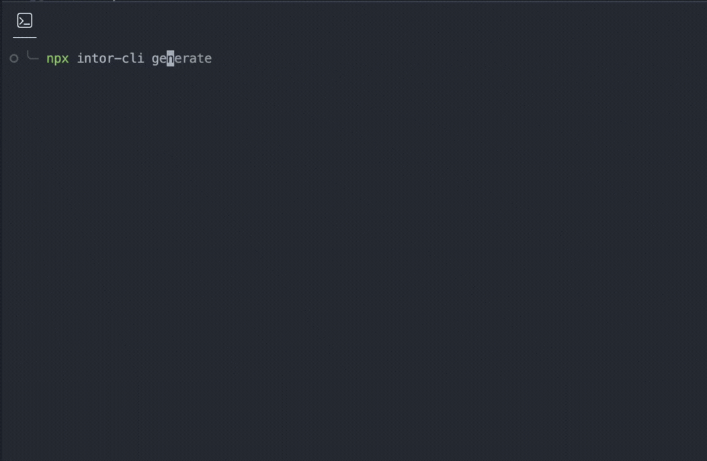
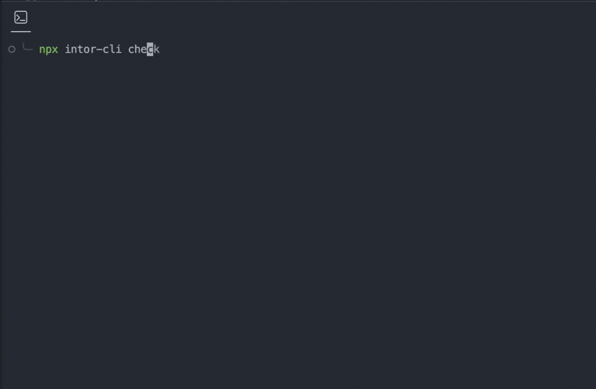

<h1 align="center">intor-cli</h1>

<div align="center">
  
CLI tool for intor.

</div>

<div align="center">

[](https://www.npmjs.com/package/intor-cli)
[](https://www.typescriptlang.org/)
[](LICENSE)

<table>
  <tr>
    <td align="center">
      
    </td>
    <td align="center">
      
    </td>
  </tr>
</table>
</div>

## Overview

- **generate** — message schema & types
- **check** — usage analysis
- **validate** — locale completeness

## Commands

#### generate

```bash
npx intor-cli generate
```

- Generates TypeScript types and schema artifacts
- Uses the default locale as the single source of truth
- Reports message override behavior during generation

#### check

```bash
npx intor-cli check
```

- Statistically analyzes translator usage in your codebase
- Detects incorrect keys, replacements, and rich tag usage
- Reports diagnostics with precise source locations

#### validate

```bash
npx intor-cli validate
```

- Validates locale message completeness against schemas
- Checks missing keys, replacements, and rich tags
- Reports issues grouped by config and locale

## Design Guarantees

- Message types are inferred from the **_default locale_** only.
- All locales are expected to share the same message shape.
- Locale is treated strictly as a runtime dimension, not a structural one.
- Generated types are intentionally conservative and do not enforce locale completeness.
